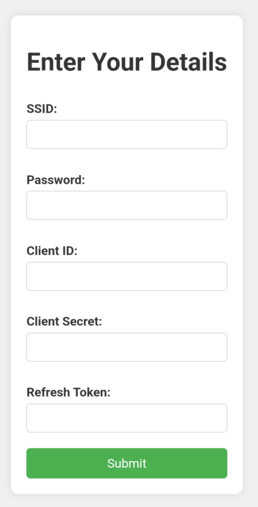

---

# m5SpotiController

## Introduction
This guide helps you generate authentication tokens required for the m5SpotiController firmware.

## Getting Started

### Prerequisites
Before you begin, make sure you have the following:
- An active Spotify account

### Steps to Obtain API Keys

1. Go to the [Spotify Developer Page](https://developer.spotify.com) and log in.
2. Open the [Spotify Developer Dashboard](https://developer.spotify.com/dashboard).
3. Click on **Create App**. 
5. Enter any name and description for your app.
6. In **Redirect URLs**, enter: `https://spotify-refresh-token-generator.netlify.app`
7. Check **Web API** and **Web Playback SDK**.
8. It should look like this: 
10. Click **Save**. Don't close the page yet, you will need Client ID and Client secret 
11. Visit the [Spotify Refresh Token Generator](https://spotify-refresh-token-generator.netlify.app/).
12. Click **Get started** and then **Skip this step**.
13. Enter the **Client ID** and **Client Secret** from your newly created Spotify app. 
14. Select **user-read-currently-playing**, **user-read-playback-position**, and **user-modify-playback-state**. 
15. Click **Get Spotify Access Code**.
16. Accept by clicking **Agree**.
17. Copy and save the generated **Auth Key**.

### Connecting to the SpotiSetup Hotspot

1. Upload the firmware to the m5stickcplus2.
2. Connect to the SpotiSetup hotspot.
3. Open a browser and go to [http://192.168.4.1](http://192.168.4.1).
4. Enter the appropriate values into the fields on the page. 
5. Click **Submit**.

## Usage Instructions

- Press button B for about 1 second to skip to the next song.
- Press button C for about 1 second to skip to the previous song.
- Press button A for about 1 second to pause/resume the song.
- Press and hold buttons C and B to start the hotspot for configuration.

## Support
For any issues or questions, please contact stachu0 on Discord.

---
